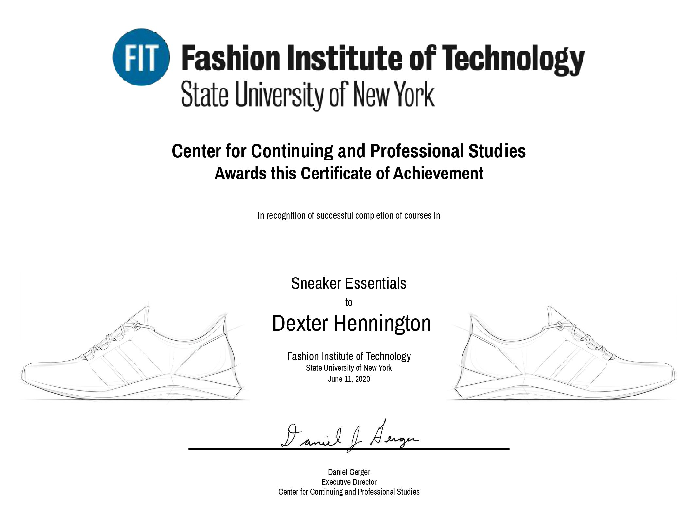
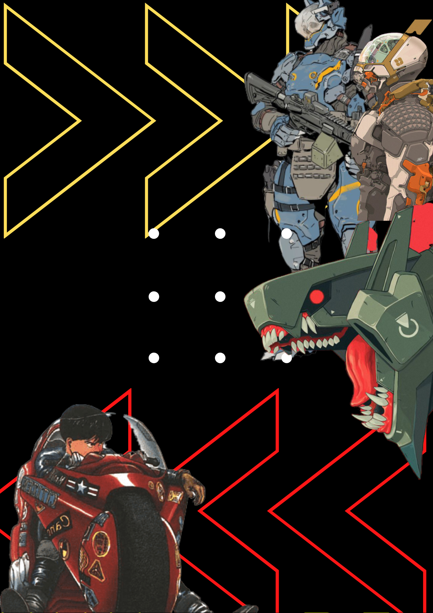
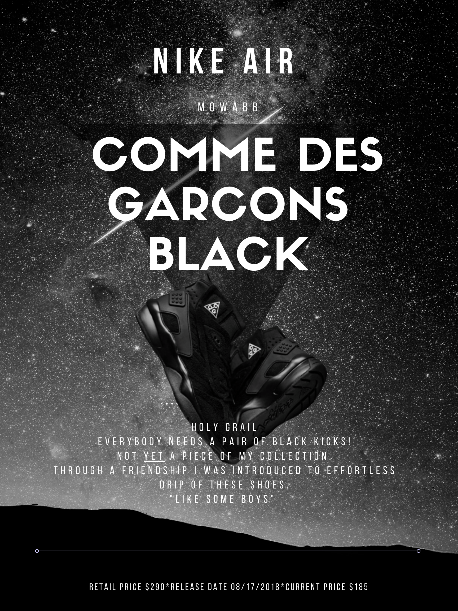
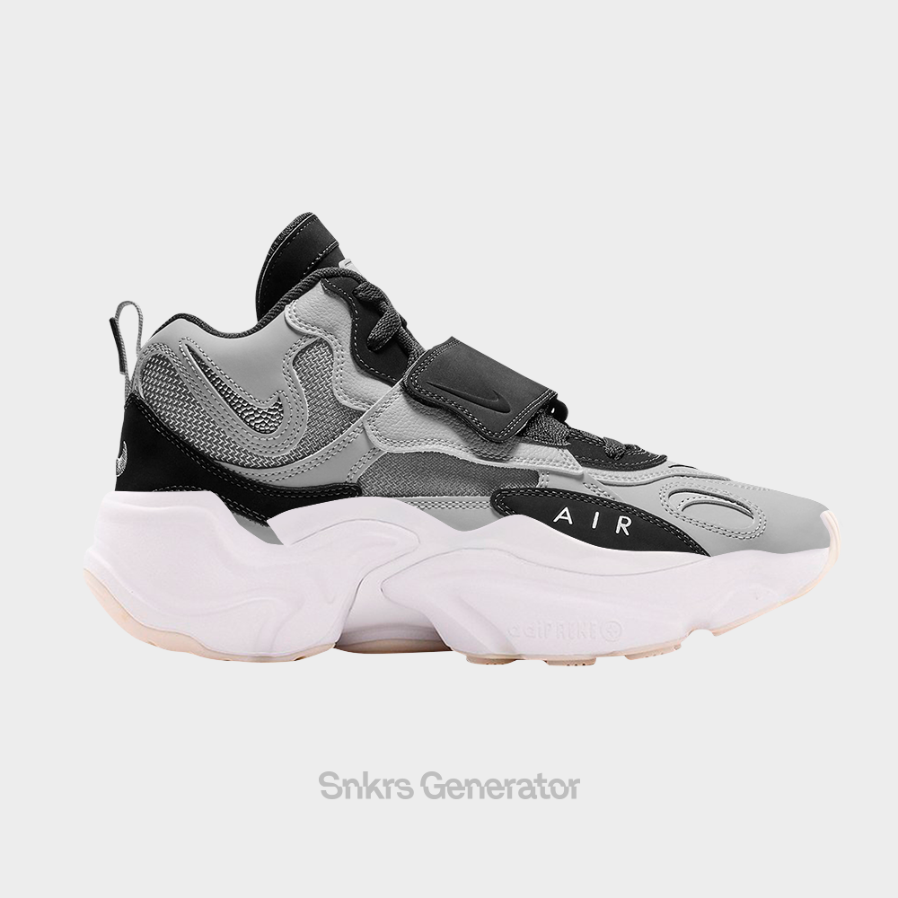
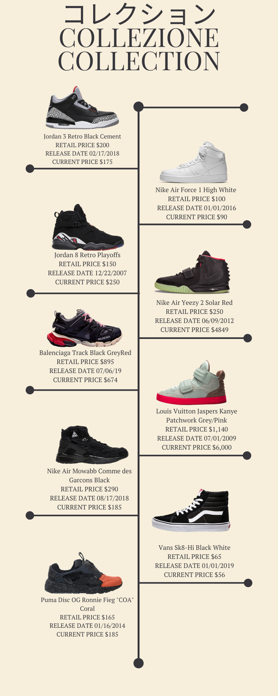
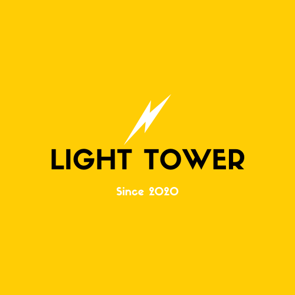

Recently i completed Fashion Institute of Technology Sneaker Essentials. 

I learned a lot. At first i thought it would just be about designing sneakers but they had you make mode boards and even make adds for your favorite sneakers!

My favorite part of the program was designing my own shoe.I was worried that my vision wouldn't come alive because i cannot draw at all. But if you look you'll find it! I found an app that allowed me to create piece other shoes together. The app is called "snkr generator"

# I present to you. "The Light House"

We were even asked to make a collection of hour favorite shoes!

 All in all i really enjoyed it. If i ever go in to the sneaker business  I think ill use the logo and name I made! 

